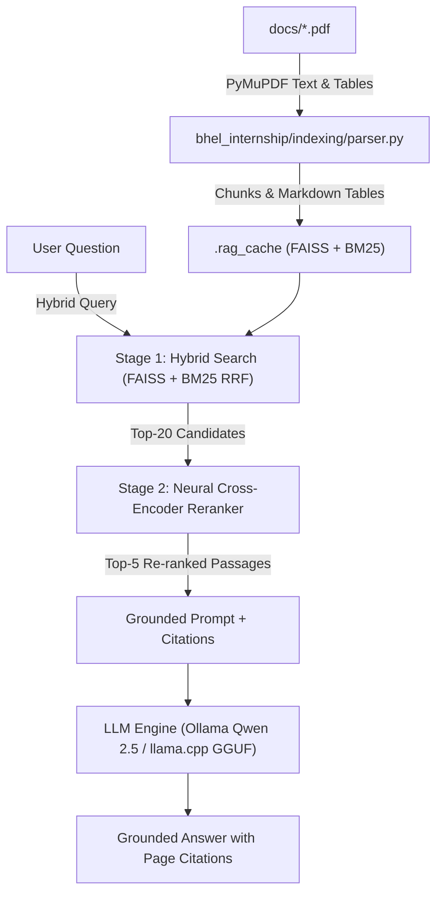

<div align="center">

# ⚡ Enterprise RAG Engine

[](https://python.org)
[](https://fastapi.tiangolo.com)
[](https://ollama.com)
[](https://github.com/facebookresearch/faiss)
[](LICENSE)

**A high-performance, privacy-preserving Retrieval-Augmented Generation system built for enterprise document intelligence at BHEL.**

[Features](#key-features) · [Architecture](#architecture-overview) · [API](#api-endpoints) · [BHEL Employee Lifecycle](#bhel-employee-lifecycle--day-in-the-life) · [Setup](#quick-start)

---

</div>

## The Problem — Document Intelligence at BHEL

Bharat Heavy Electricals Limited (BHEL) operates with a vast corpus of internal technical manuals, policy documents, curriculum syllabi, compliance reports, and engineering specifications — often spanning hundreds of pages across dozens of PDFs.

**Current pain points this engine solves:**

- **Manual document lookup is slow** — Engineers and staff spend significant time searching through lengthy PDF documents for specific technical details, policy clauses, or curriculum requirements.
- **Keyword search falls short** — Traditional search misses semantically relevant passages when the exact keywords don't match (e.g., searching "passing marks" when the document says "minimum grade criteria").
- **No verifiable citations** — Generic AI chatbots hallucinate answers without pointing to exact page numbers and source passages, making them unreliable for compliance-critical queries.
- **Data privacy concerns** — Sensitive BHEL documents cannot be uploaded to third-party cloud APIs. All processing must happen **locally on-premise**.

**This Enterprise RAG Engine** provides a fully local, GPU-accelerated document QA system that retrieves grounded answers with exact page citations from indexed PDFs — no data ever leaves the machine.

---

## Key Features

- **Two-Stage Hybrid Retrieval Pipeline**
  - **Stage 1A — Dense Semantic**: FAISS inner-product cosine similarity via `all-MiniLM-L6-v2` (CUDA-accelerated when available)
  - **Stage 1B — Sparse Lexical**: BM25Okapi for exact keyword matches (course codes, acronyms, credit numbers)
  - **Reciprocal Rank Fusion (RRF)**: Merges dense and lexical candidate lists with balanced weighting

- **Neural Cross-Encoder Re-ranking**
  - Re-ranks candidate passages using `cross-encoder/ms-marco-MiniLM-L-6-v2` to prioritize high-precision context for the LLM

- **Fully Local & Private**
  - Runs entirely on-premise via **Ollama** (Qwen 2.5:7b) or **llama.cpp** GGUF models
  - Zero data leaves the machine — suitable for classified/internal documents

- **Native Document Ingestion & Caching**
  - High-speed PyMuPDF text normalization and native table extraction into clean Markdown tables
  - Persistent disk caching in `.rag_cache/` with SHA-256 manifest validation for sub-second startup (<0.2s)

- **Dark Chat Web Interface**
  - Minimalist ChatGPT-style UI with deep dark palette and Inter typography
  - Previous chats sidebar with search, rename, and persistent local history
  - Token-streamed answers with stop/regenerate, copy buttons, and code copying
  - Expandable citation panels with per-source verification badges
  - Document scope filter, abstention notices, suggestion cards, `Ctrl+K` new chat
  - Full Markdown & table rendering with copy-to-clipboard

- **FastAPI Backend**
  - Interactive OpenAPI docs at `/docs`
  - Streaming SSE support at `/api/chat`
  - Document-scoped query filtering via `doc_name` parameter

- **Production-Grade Faithfulness**
  - Citation verification against retrieved passages
  - Corrective retry on ungrounded claims (one strict-prompt reattempt)
  - Abstention gate when cross-encoder confidence is too low
  - Index-grounded vague-query detection (no hardcoded word lists)
  - Eval harness with goldens (retrieval hits, keyword coverage, grounding rate)

---

## Architecture Overview



---

## API Endpoints

| Method | Endpoint | Description |
|---|---|---|
| `GET` | `/` | Web-based chat interface |
| `POST` | `/ask` | RAG question-answering with formatted HTML, raw text, and citations |
| `POST` | `/api/chat` | JSON & SSE streaming endpoint (`stream: true`) |
| `GET` | `/api/documents` | List indexed PDFs, file sizes, and chunk statistics |
| `POST` | `/api/reindex` | Trigger fresh re-indexing of all documents in `docs/` |
| `GET` | `/api/status` | System health, active LLM model, device, and chunk count |

---

## Project Structure

```
bhel_internship/
├── app.py                # Uvicorn launcher (simple entrypoint)
├── bhel_internship/      # Main application package
│   ├── __init__.py       # Package version + lazy engine exports
│   ├── __main__.py       # `python -m bhel_internship` (CLI) / `python -m bhel_internship serve`
│   ├── cli.py            # Interactive terminal CLI
│   ├── core/
│   │   ├── config.py     # Settings (env / .env) + path & tuning constants
│   │   ├── logger.py     # Rich colorized structured logging
│   │   └── exceptions.py # Shared domain exceptions
│   ├── indexing/
│   │   ├── parser.py     # PDF text/table extraction, headings, OCR fallback
│   │   └── chunker.py    # Recursive text splitting with overlap
│   ├── retrieval/
│   │   └── hybrid.py     # FAISS + BM25 RRF + cross-encoder reranker
│   ├── llm/
│   │   ├── provider.py   # LLM connectors (Ollama & llama-cpp-python)
│   │   └── prompts.py    # Grounded system prompt
│   ├── engine/
│   │   ├── pipeline.py   # RAG orchestration + singleton accessor
│   │   └── grounding.py  # Citation verification + refusal detection
│   ├── eval/
│   │   ├── harness.py    # Goldens-based eval (context/coverage/grounding)
│   │   └── cli.py        # `python -m bhel_internship eval goldens.json`
│   └── api/
│       ├── routes.py     # FastAPI app factory + route definitions
│       ├── schemas.py    # Pydantic request/response models
│       └── deps.py       # Shared engine dependency
├── eval/
│   └── goldens.example.json  # Sample eval cases (copy + adapt)
├── docs/                 # Source PDF documents (git-ignored, keep .gitkeep)
├── models/               # Local model binaries (git-ignored, keep .gitkeep)
├── static/
│   └── js/marked.min.js  # Offline Markdown parser
└── templates/
    └── index.html        # ChatGPT-style dark chat UI
```

---

## BHEL Employee Lifecycle & Day in the Life

This section shows how a BHEL employee uses this engine end-to-end — from adding documents to getting grounded answers for real work scenarios.

### 1. Initial Setup (One-time, ~5 minutes)

**IT Admin / Power User:**
```bash
# 1. Clone repo to on-prem server or workstation
git clone https://github.com/yourorg/bhel_internship.git
cd bhel_internship

# 2. Create venv & install deps (includes sentence-transformers, FAISS, llama-cpp)
python -m venv venv
source venv/bin/activate
pip install -r requirements.txt

# 3. Start Ollama locally (runs as a background service)
ollama serve &
ollama pull qwen2.5:7b          # ~4.7GB, downloads once
# Or for air-gapped: place GGUF in models/ and set LLM_PROVIDER=llamacpp

# 4. Launch the server
python app.py
# Server running at http://localhost:5000
```

### 2. Document Ingestion (Department Admin)

**HR / Training / Engineering Admin drops PDFs into `docs/`:**

```
docs/
├── BHEL_Employee_Handbook_2024.pdf
├── Safety_Manual_Boiler_Division.pdf
├── Quality_Procedures_ISO_9001.pdf
├── Curriculum_Syllabi_CSE_2026.pdf
├── Vendor_Qualification_Checklist.pdf
└── Project_Execution_Guidelines.pdf
```

**Trigger re-index (or wait for auto-detect on next query):**
```bash
curl -X POST http://localhost:5000/api/reindex
# Or click "Reindex" in the web UI header
```
*First index: ~30-60s for 500-page corpus. Subsequent runs: incremental (only changed files re-encoded).*

### 3. Daily Usage — Role-Based Scenarios

| Role | Typical Questions | Value |
|------|-------------------|-------|
| **Graduate Engineer Trainee (GET)** | *"What's the passing criteria for B.Tech CSE 2026 batch?"* | Instant answer with page citation from syllabus PDF — no hunting through 200-page document |
| **Senior Engineer (Design)** | *"Flange pressure rating class 300 temperature derating formula"* | Finds exact table row in ASME code extract; copies Markdown table to calculation sheet |
| **Quality Auditor** | *"ISO 9001 clause 8.5.1 production control requirements"* | Retrieves verbatim clause + surrounding context; verified citation badge = audit-ready |
| **Safety Officer** | *"Hot work permit validity period in boiler division"* | Gets precise policy clause; cross-references with vendor checklist automatically |
| **Procurement Lead** | *"Vendor qualification documents required for thermal equipment"* | Extracts checklist table; exports as Markdown for RFQ attachment |
| **Project Manager** | *"Milestone payment terms in EPC contract template"* | Finds clause across contract PDFs; cites page for legal review |

### 4. Web UI Workflow (ChatGPT-style)

```
1. Open http://localhost:5000
2. Sidebar: "New Chat" (Ctrl+K) → type question
3. Select document scope: [All Documents ▼] → "Safety_Manual_Boiler_Division.pdf"
4. Streamed answer appears with:
   - ✅ Verified citation badges (green = grounded, yellow = unverified)
   - Expandable source panels showing exact page snippet
   - Copy button per source / copy full answer
5. "Regenerate" if needed; "Stop" mid-stream
6. History auto-saved → searchable in sidebar
```

### 5. API Integration (Automation)

**Slack bot / internal portal / CI gate:**
```python
import httpx

resp = httpx.post("http://localhost:5000/ask", json={
    "question": "What is the minimum passing grade for CS201?",
    "top_n": 5,
    "doc_name": "Curriculum_Syllabi_CSE_2026.pdf"
}).json()

# resp["response"] — HTML formatted
# resp["raw_text"] — plain text for tickets
# resp["sources"] — [{"document": "...", "page": 12, "score": 0.87, "snippet": "..."}]
# resp["grounding"]["grounding_rate"] — 1.0 = fully grounded
```

### 6. Evaluation & Quality Assurance

**QA Team validates answer quality on golden set:**
```bash
cp eval/goldens.example.json eval/goldens.json
# Edit goldens.json with your document-specific Q&A pairs
python -m bhel_internship eval eval/goldens.json
```

**Output:**
```
Eval Results
┏━━━┳━━━━━━━━━━━━━━━━━━━━━━━━━━━━━━━━━━━━━┳━━━━━━━━━┳━━━━━━━┳━━━━━━━━━━┳━━━━━━━━━┓
┃ # ┃ Question                              ┃ Ctx     ┃ Cover ┃ Ground ┃ Result  ┃
┡━━━╇━━━━━━━━━━━━━━━━━━━━━━━━━━━━━━━━━━━━━╇━━━━━━━━━╇━━━━━━━╇━━━━━━━━━━╇━━━━━━━━━┩
│ 1 │ Passing grade for B.Tech CSE?         ┃ ✓       ┃ 1.00  ┃ 1.00   ┃ PASS    │
│ 2 │ ISO 9001 production control clauses   ┃ ✓       ┃ 0.80  ┃ 0.83   ┃ PASS    │
│ 3 │ Hot work permit validity              ┃ ✓       ┃ 1.00  ┃ 1.00   ┃ PASS    │
└─────┴─────────────────────────────────────┴─────────┴───────┴────────┴─────────┘
{"total": 3, "passed": 3, "pass_rate": 1.0, "context_hit_rate": 1.0, ...}
```

---

## Quick Start

### 1. Prerequisites

- Python 3.10+
- [Ollama](https://ollama.com/) running locally with `qwen2.5:7b`:
  ```bash
  ollama run qwen2.5:7b
  ```
  *For air-gapped environments: download a GGUF (e.g., `tinyllama-1.1b-chat-v1.0.Q5_K_M.gguf`) to `models/` and set `LLM_PROVIDER=llamacpp` in `.env`.*

### 2. Install Dependencies

```bash
# Clone the repository
git clone https://github.com/yourusername/bhel_internship.git
cd bhel_internship

# Create and activate virtual environment
python -m venv venv
source venv/bin/activate      # Linux / macOS
# venv\Scripts\activate       # Windows

# Install requirements
pip install -r requirements.txt
```

### 3. Add Documents

Place your PDF files in the `docs/` directory:
```bash
cp /path/to/your/documents/*.pdf docs/
```

### 4. Run the Server

```bash
python app.py
# or
python -m bhel_internship serve
```

- **Web Interface**: [http://localhost:5000](http://localhost:5000)
- **API Docs**: [http://localhost:5000/docs](http://localhost:5000/docs)

### 5. Run the CLI (Optional)

```bash
# Single question
python -m bhel_internship -q "What is the passing criteria?"

# Interactive REPL
python -m bhel_internship

# Rebuild index first
python -m bhel_internship --reindex
```

### 6. Run an Eval (Optional)

```bash
cp eval/goldens.example.json eval/goldens.json
# edit eval/goldens.json to match your PDFs
python -m bhel_internship eval eval/goldens.json
```

---

## Configuration

Settings can be customized via environment variables or a `.env` file (see `bhel_internship/core/config.py`):

| Variable | Default | Description |
|---|---|---|
| `HOST` | `0.0.0.0` | Server host address |
| `PORT` | `5000` | Server port |
| `CHUNK_SIZE` | `650` | Character/token chunk length |
| `CHUNK_OVERLAP` | `120` | Overlap between consecutive chunks |
| `TOP_K_CANDIDATES` | `20` | Candidate chunks from stage-1 hybrid search |
| `TOP_N_RERANK` | `5` | Passages selected after neural reranking |
| `LLM_PROVIDER` | `auto` | Provider priority: `auto`, `ollama`, or `llamacpp` |
| `OLLAMA_MODEL` | `qwen2.5:7b` | Target Ollama model name |
| `OLLAMA_BASE_URL` | `http://localhost:11434` | Ollama service endpoint |
| `USE_RERANKER` | `true` | Enable/disable neural cross-encoder reranking |
| `RERANK_FUSION_ALPHA` | `0.85` | Blend of cross-encoder vs RRF score for final ordering |
| `MMR_ENABLED` | `true` | Diversify final top-N with Maximal Marginal Relevance |
| `MMR_LAMBDA` | `0.5` | MMR relevance/diversity trade-off (1.0 = relevance only) |
| `ENABLE_ABSTENTION` | `true` | Abstain when the best reranker score is too weak |
| `ABSTAIN_MIN_SCORE` | `-10.0` | Minimum best cross-encoder score to attempt an answer |
| `ENABLE_CORRECTIVE_RETRY` | `true` | One strict-prompt retry on ungrounded citations |
| `ENABLE_OCR` | `true` | OCR scanned pages via tesseract CLI (if installed) |
| `OCR_DPI` | `300` | Render resolution for OCR pages |
| `OCR_MIN_CHARS` | `50` | Below this, image pages trigger OCR |

---

## Faithfulness Guarantees (Why Trust This?)

1. **Citation Verification** — Every `[Document, Page X]` marker in the answer is checked against the actual retrieved chunks. Unverified citations are flagged in the UI and API response.

2. **Corrective Retry** — If the LLM produces ungrounded citations, a second strict-prompt attempt is made automatically. The better of the two answers is returned.

3. **Abstention Gate** — When the cross-encoder's best score falls below `ABSTAIN_MIN_SCORE` (default -10.0 logits), the engine refuses to answer rather than hallucinate.

4. **Index-Grounded Specificity** — Vague queries ("hi", "hello", "anything?") are detected by checking if query tokens exist in *some-but-not-most* indexed chunks. No hardcoded stopword lists — works for any corpus.

5. **Eval Harness** — Goldens-based regression testing measures retrieval hit rate, keyword coverage, and grounding rate. CI-friendly exit codes.

---

## License

MIT — see [LICENSE](LICENSE) for details.

---

## Contributing

Issues and PRs welcome. Please run the eval harness before submitting:

```bash
python -m bhel_internship eval eval/goldens.json
```

---

*Built for BHEL — Local. Private. Grounded.*