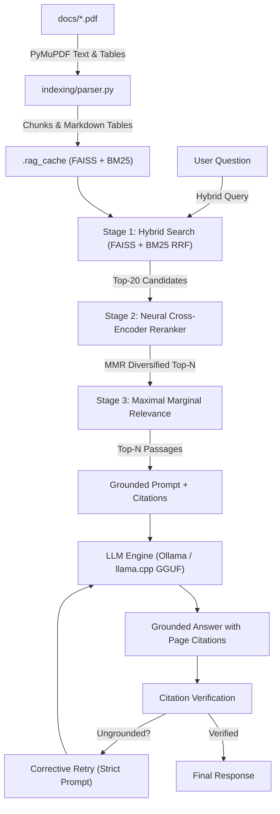

# Enterprise RAG Engine

[](https://python.org)
[](https://fastapi.tiangolo.com)
[](https://ollama.com)
[](https://github.com/facebookresearch/faiss)

**A high-performance, privacy-preserving Retrieval-Augmented Generation engine for enterprise document intelligence.**

[Features](#key-features) · [Architecture](#architecture-overview) · [API](#api-endpoints) · [Setup](#quick-start) · [Configuration](#configuration)

---

## Overview

The Enterprise RAG Engine provides a fully local, GPU-accelerated document QA system that retrieves grounded answers with exact page citations from indexed PDFs. No data ever leaves the machine.

---

## Key Features

- **Two-Stage Hybrid Retrieval Pipeline**
  - Dense semantic search via FAISS using `all-MiniLM-L6-v2`
  - Sparse lexical search via BM25Okapi
  - Reciprocal Rank Fusion (RRF) for balanced merging
  - Multi-query expansion for technical document tokenization

- **Neural Cross-Encoder Re-ranking**
  - Re-ranks candidates using `cross-encoder/ms-marco-MiniLM-L-6-v2`
  - Configurable alpha blending with RRF scores

- **Maximal Marginal Relevance (MMR) Diversification**
  - Reduces redundancy in retrieved passages

- **Fully Local & Private**
  - Runs via Ollama or llama.cpp GGUF models
  - Zero data leaves the machine

- **Native Document Ingestion**
  - High-speed PyMuPDF text normalization and table extraction
  - Persistent disk caching with SHA-256 validation
  - Incremental re-indexing

- **Production-Grade Faithfulness**
  - Citation verification against retrieved passages
  - Corrective retry on ungrounded claims
  - Abstention gate for low-confidence queries

---

## Architecture Overview



---

## API Endpoints

| Method | Endpoint | Description |
|--------|----------|-------------|
| `GET` | `/` | Web-based chat interface |
| `POST` | `/ask` | RAG question-answering with formatted HTML and citations |
| `POST` | `/api/chat` | JSON & SSE streaming endpoint (`stream: true`) |
| `GET` | `/api/documents` | List indexed PDFs, file sizes, and chunk statistics |
| `POST` | `/api/reindex` | Trigger fresh re-indexing of all documents |
| `GET` | `/api/status` | System health, active LLM model, device, and chunk count |

---

## Project Structure

```
bhel_internship/              # Repository root
├── src/                      # Python package (all source code)
│   ├── api/                  # FastAPI backend
│   │   ├── routes.py         # FastAPI app factory + route definitions
│   │   ├── schemas.py        # Pydantic request/response models
│   │   └── deps.py           # Shared engine dependency
│   ├── core/                 # Core engine components
│   │   ├── config.py         # Settings + path & tuning constants
│   │   ├── logger.py         # Rich colorized structured logging
│   │   └── exceptions.py     # Shared domain exceptions
│   ├── engine/               # RAG orchestration
│   │   ├── pipeline.py       # RAG orchestration + singleton accessor
│   │   └── grounding.py      # Citation verification + refusal detection
│   ├── indexing/             # Document processing
│   │   ├── parser.py         # PDF text/table extraction, headings, OCR fallback
│   │   └── chunker.py        # Recursive text splitting with overlap
│   ├── llm/                  # Language model integration
│   │   ├── provider.py       # LLM connectors (Ollama & llama-cpp-python)
│   │   └── prompts.py        # Grounded system prompt
│   ├── retrieval/            # Hybrid retrieval
│   │   └── hybrid.py         # FAISS + BM25 + RRF + cross-encoder reranker
│   ├── eval/                 # Evaluation tools
│   │   ├── harness.py        # Goldens-based eval (context/coverage/grounding)
│   │   ├── cli.py            # `python -m src eval goldens.json`
│   │   └── goldens.example.json
│   ├── ui/                   # Web UI
│   │   └── templates/
│   │       └── index.html    # ChatGPT-style interface
│   ├── __init__.py
│   ├── __main__.py           # `python -m src serve|eval`
│   └── cli.py                # Interactive terminal chat
├── docs/                     # Drop PDFs here to index them
├── models/                   # Place GGUF model files here
├── .env.example              # Environment configuration template
├── .gitignore
└── requirements.txt          # Python dependencies
```

---

## Quick Start

### 1. Initial Setup (One-time)

```bash
# Clone repository
git clone https://github.com/adhvaith267/bhel_internship.git
cd bhel_internship

# Create virtual environment and install dependencies
python -m venv venv
source venv/bin/activate  # Linux/macOS
# venv\Scripts\activate   # Windows
pip install -r requirements.txt

# Install local model
ollama pull qwen2.5:7b  # or set LLM_PROVIDER=llamacpp
```

### 2. Add Documents

Place PDF files in the `docs/` directory:
```bash
cp /path/to/documents/*.pdf docs/
```

### 3. Run the RAG Engine

```bash
python -m src serve
```

**Access the interface:** `http://localhost:5000`

### 4. Basic Usage

**Web Interface (ChatGPT-style):**
- Chat directly in your browser
- Document scope filtering via dropdown
- Citation verification badges
- Copy/cite functionality

**API Usage:**
```python
import httpx

response = httpx.post(
    "http://localhost:5000/ask",
    json={
        "question": "What are the attendance requirements for theory courses?",
        "top_n": 5,
        "doc_name": "B.TechCSE-2026-27-Curriculum-Syllabi.pdf"
    }
)
```

---

## Configuration

Settings are customized via environment variables or a `.env` file:

| Variable | Default | Description |
|----------|---------|-------------|
| `HOST` | `0.0.0.0` | Server host address |
| `PORT` | `5000` | Server port |
| `CHUNK_SIZE` | `650` | Character/token chunk length |
| `CHUNK_OVERLAP` | `120` | Overlap between chunks |
| `TOP_K_CANDIDATES` | `20` | Candidate chunks from stage-1 hybrid search |
| `TOP_N_RERANK` | `5` | Passages selected after neural reranking |
| `DENSE_WEIGHT` | `0.6` | Weight of dense retrieval in RRF |
| `BM25_WEIGHT` | `0.4` | Weight of BM25 in RRF |
| `LLM_PROVIDER` | `auto` | Provider: `auto`, `ollama`, or `llamacpp` |
| `OLLAMA_MODEL` | `qwen2.5:7b` | Target Ollama model name |

---

*Built for Enterprise — Local. Private. Grounded.*
