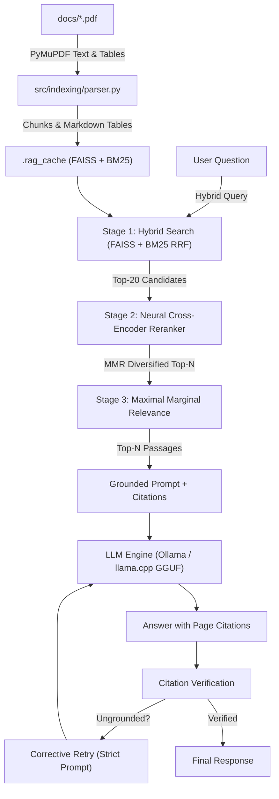

# Enterprise RAG Engine

[](https://python.org)
[](https://fastapi.tiangolo.com)
[](https://ollama.com)
[](https://github.com/facebookresearch/faiss)

**A fully local, privacy-preserving Retrieval-Augmented Generation engine for enterprise document intelligence.**

---

## Overview

Ask questions about your PDF documents and get grounded answers with exact page citations — entirely on your own machine. No data ever leaves the server.

Drop your PDFs into `docs/`, start the server, and ask away at `http://localhost:5000`.

---

## Key Features

- **Hybrid Retrieval** — Dense semantic search (FAISS) + sparse lexical search (BM25) fused via Reciprocal Rank Fusion, with multi-query expansion for technical terminology
- **Neural Re-ranking** — Cross-encoder (`cross-encoder/ms-marco-MiniLM-L-6-v2`) re-scores candidates for precision; lazy-loaded on first query for fast startup
- **MMR Diversification** — Maximal Marginal Relevance removes redundant passages from the final context
- **Grounded Answers** — Every claim is verified against retrieved passages; ungrounded citations trigger an automatic corrective retry
- **Abstention** — The engine refuses to answer rather than hallucinate when evidence is too weak
- **OCR Fallback** — Scanned/image-only PDF pages are automatically processed via Tesseract
- **Incremental Indexing** — Only new or changed PDFs are re-embedded on restart; unchanged files are loaded from cache
- **Streaming UI** — Token-by-token SSE streaming with a full chat history sidebar (localStorage)
- **Fully Local & Private** — Runs via Ollama or a local GGUF file; zero internet calls for inference

---

## Architecture



---

## Technologies

| Component | Technology |
|-----------|-----------|
| Web framework | FastAPI + Uvicorn |
| Embedding model | `sentence-transformers/all-MiniLM-L6-v2` |
| Vector search | FAISS |
| Lexical search | BM25Okapi (`rank-bm25`) |
| Re-ranker | `cross-encoder/ms-marco-MiniLM-L-6-v2` |
| PDF parsing | PyMuPDF (`pymupdf`) |
| OCR | Tesseract CLI (optional) |
| LLM inference | Ollama or llama-cpp-python (GGUF) |
| Default LLM | `qwen2.5:7b` via Ollama |

---

## Project Structure

```
bhel_internship/
├── src/
│   ├── api/            # FastAPI routes, schemas, dependencies
│   ├── core/           # Config, logger, exceptions
│   ├── engine/         # RAG pipeline and citation grounding
│   ├── indexing/       # PDF parsing and text chunking
│   ├── llm/            # Ollama and llama.cpp connectors
│   ├── retrieval/      # Hybrid FAISS + BM25 + reranker
│   └── ui/
│       ├── static/js/  # Frontend JS (app.js, marked.min.js)
│       └── templates/  # Jinja2 HTML template
├── docs/               # Place your PDF files here
├── models/             # Place GGUF model files here (optional)
├── .env.example        # Configuration template
└── requirements.txt
```

---

## Setup

### 1. Clone and install

```bash
git clone https://github.com/adhvaith267/bhel_internship.git
cd bhel_internship
python -m venv venv
source venv/bin/activate      # Windows: venv\Scripts\activate
pip install -r requirements.txt
```

### 2. Set up a language model

**Option A — Ollama (recommended):**
```bash
# Install Ollama from https://ollama.com, then:
ollama pull qwen2.5:7b
```

**Option B — GGUF (fully offline):**
Download any GGUF model and place it in `models/`. Good starting points:
- [TinyLlama 1.1B Q5](https://huggingface.co/TheBloke/TinyLlama-1.1B-Chat-v1.0-GGUF) — lightweight, fast
- [Mistral 7B Q4](https://huggingface.co/TheBloke/Mistral-7B-Instruct-v0.2-GGUF) — better quality

Set in `.env`:
```
LLM_PROVIDER=llamacpp
GGUF_MODEL_PATH=models/your-model-file.gguf
```

### 3. Add documents

Place PDF files in `docs/`. The engine indexes all PDFs on startup.

### 4. Start the server

```bash
python -m src
```

Open `http://localhost:5000` in your browser.

---

## Usage

- **Ask questions** — type in the chat box and press Enter (Shift+Enter for a new line)
- **Filter by document** — use the dropdown in the top-right to restrict answers to one PDF
- **Reindex** — add new PDFs to `docs/` and click the **Reindex** button (or restart the server)
- **Chat history** — previous conversations are saved in the browser's localStorage; rename, pin, or delete them from the sidebar

---

## Configuration

Copy `.env.example` to `.env` and edit as needed:

| Variable | Default | Description |
|----------|---------|-------------|
| `PORT` | `5000` | Server port |
| `LLM_PROVIDER` | `auto` | `auto`, `ollama`, or `llamacpp` |
| `OLLAMA_MODEL` | `qwen2.5:7b` | Ollama model to use |
| `GGUF_MODEL_PATH` | `models/tinyllama-...gguf` | Path to GGUF file |
| `CHUNK_SIZE` | `650` | Characters per chunk |
| `TOP_N_RERANK` | `5` | Passages sent to the LLM |
| `ENABLE_OCR` | `true` | OCR fallback for scanned pages |

All tuning variables (RRF weights, MMR settings, abstention thresholds) are documented in `.env.example`.

---

*Local. Private. Grounded.*
