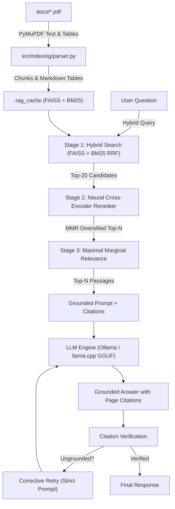

# Enterprise RAG Engine

[](https://python.org)
[](https://fastapi.tiangolo.com)
[](https://ollama.com)
[](https://github.com/facebookresearch/faiss)

**A fully local, privacy-preserving Retrieval-Augmented Generation engine for enterprise document intelligence.**

---

## Overview

The Enterprise RAG Engine lets you ask questions about your PDF documents and get grounded answers with exact page citations — entirely on your own machine. No data ever leaves the server. The only entry point is the web interface at `http://localhost:5000`.

Drop your PDFs into `docs/`, start the server, and ask away.

---

## Key Features

- **Hybrid Retrieval** — Dense semantic search (FAISS) and sparse lexical search (BM25) combined via Reciprocal Rank Fusion, with multi-query expansion for technical terminology
- **Neural Re-ranking** — Cross-encoder (`cross-encoder/ms-marco-MiniLM-L-6-v2`) re-scores candidates for precision
- **MMR Diversification** — Maximal Marginal Relevance removes redundant passages from the final context
- **Grounded Answers** — Every claim is verified against retrieved passages; ungrounded citations trigger an automatic corrective retry
- **Abstention** — The engine refuses to answer rather than hallucinate when evidence is too weak
- **OCR Fallback** — Scanned/image-only PDF pages are automatically processed via Tesseract
- **Incremental Indexing** — Only new or changed PDFs are re-embedded on restart; unchanged files are loaded from cache
- **Fully Local & Private** — Runs via Ollama or a local GGUF file; no internet calls for inference

---

## Architecture



---

## Technologies Used

| Component | Technology |
|-----------|-----------|
| Web framework | FastAPI + Uvicorn |
| Embedding model | `sentence-transformers/all-MiniLM-L6-v2` |
| Vector search | FAISS (Facebook AI Similarity Search) |
| Lexical search | BM25Okapi (`rank-bm25`) |
| Re-ranker | `cross-encoder/ms-marco-MiniLM-L-6-v2` |
| PDF parsing | PyMuPDF (fitz) |
| OCR | Tesseract CLI (optional) |
| LLM inference | Ollama or llama-cpp-python (GGUF) |
| Default LLM | `qwen2.5:7b` via Ollama |

---

## Project Structure

```
bhel_internship/
├── src/                    # All source code
│   ├── api/                # FastAPI routes, schemas, dependencies
│   ├── core/               # Config, logger, exceptions
│   ├── engine/             # RAG pipeline and citation grounding
│   ├── indexing/           # PDF parsing and text chunking
│   ├── llm/                # Ollama and llama.cpp connectors
│   ├── retrieval/          # Hybrid FAISS + BM25 + reranker
│   └── ui/templates/       # Web interface (index.html)
├── docs/                   # Place your PDF files here
├── models/                 # Place GGUF model files here (optional)
├── .env.example            # Configuration template
└── requirements.txt
```

---

## Setup

### 1. Install dependencies

```bash
git clone https://github.com/adhvaith267/bhel_internship.git
cd bhel_internship
python -m venv venv
source venv/bin/activate   # Windows: venv\Scripts\activate
pip install -r requirements.txt
```

### 2. Set up a language model

**Option A — Ollama (recommended):**
```bash
# Install Ollama from https://ollama.com, then:
ollama pull qwen2.5:7b
```

**Option B — GGUF (fully offline, no Ollama needed):**
Download any GGUF model and place it in `models/`. A good starting point:
- [TinyLlama 1.1B Q5](https://huggingface.co/TheBloke/TinyLlama-1.1B-Chat-v1.0-GGUF) — lightweight, fast
- [Mistral 7B Q4](https://huggingface.co/TheBloke/Mistral-7B-Instruct-v0.2-GGUF) — better quality

Then set in your `.env`:
```
LLM_PROVIDER=llamacpp
GGUF_MODEL_PATH=models/your-model-file.gguf
```

### 3. Add your documents

See the [docs/ and models/](#docs-and-models) section below.

### 4. Start the server

```bash
python -m src
```

Open `http://localhost:5000` in your browser.

---

## docs/ and models/

### docs/
This is where you place the PDF files you want to query. The engine indexes everything in this folder on startup.

- Supports any PDF — text-based, scanned, or mixed
- Scanned pages are automatically OCR'd if Tesseract is installed
- Tables are extracted and indexed separately as Markdown
- Adding or replacing a PDF and restarting the server will re-index only the changed file — everything else is loaded from cache
- You can also trigger re-indexing without restarting via the **Reindex** button in the web interface

### models/
Only needed if you are using the `llamacpp` provider instead of Ollama. Place your `.gguf` model file here and point `GGUF_MODEL_PATH` to it in your `.env`.

Download GGUF models from [Hugging Face — TheBloke's collection](https://huggingface.co/TheBloke) (search for any model + "GGUF"). Quantized versions (`Q4_K_M`, `Q5_K_M`) offer the best size/quality tradeoff for local use.

If you are using Ollama, this folder can stay empty.

---

## Configuration

Copy `.env.example` to `.env` and edit as needed. Key variables:

| Variable | Default | Description |
|----------|---------|-------------|
| `PORT` | `5000` | Server port |
| `LLM_PROVIDER` | `auto` | `auto`, `ollama`, or `llamacpp` |
| `OLLAMA_MODEL` | `qwen2.5:7b` | Ollama model to use |
| `GGUF_MODEL_PATH` | `models/tinyllama-...gguf` | Path to GGUF file |
| `CHUNK_SIZE` | `650` | Characters per chunk |
| `TOP_N_RERANK` | `5` | Passages sent to the LLM |
| `ENABLE_OCR` | `true` | OCR fallback for scanned pages |

All other tuning variables (RRF weights, MMR settings, abstention thresholds) are documented in `.env.example`.

---

*Built for Enterprise — Local. Private. Grounded.*
